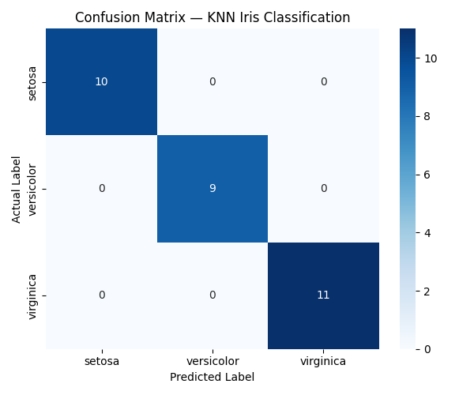
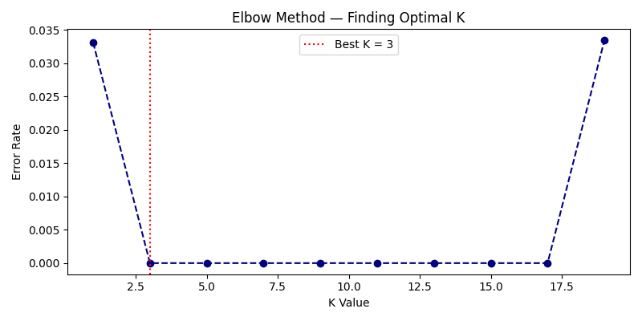

# Project 2: Data Classification Using AI
## DecodeLabs Industrial Training — Batch 2026

This project demonstrates the implementation of a machine learning workflow for classifying flower species from the **Iris dataset** using the **K-Nearest Neighbors (KNN)** algorithm. It covers loading the dataset, data preprocessing (feature scaling), splitting data into training and testing sets, training the KNN classifier, model evaluation, confusion matrix visualization, and hyperparameter tuning using the Elbow Method to find the optimal $K$ value.

---

## 1. Algorithm Overview

### K-Nearest Neighbors (KNN)
KNN is a non-parametric, supervised learning algorithm used for classification. The core assumption is that similar data points exist in close proximity to each other.

#### Step-by-Step Algorithm Process:
1. **Load Data**: Load the features and labels from the Iris dataset.
2. **Feature Scaling (Standardization)**: Normalize features to ensure all dimensions contribute equally to the distance calculation.
   $$\mu = \frac{1}{N} \sum_{i=1}^{N} x_i$$
   $$\sigma = \sqrt{\frac{1}{N} \sum_{i=1}^{N} (x_i - \mu)^2}$$
   $$z = \frac{x - \mu}{\sigma}$$
3. **Train-Test Split**: Split the dataset into $80\%$ training and $20\%$ testing data.
4. **Distance Calculation**: For a new test sample, calculate its distance to all training samples using the **Euclidean Distance** formula:
   $$d(p, q) = \sqrt{\sum_{i=1}^{n} (q_i - p_i)^2}$$
   where $p$ and $q$ are two data points represented as vectors of features.
5. **Identify Neighbors**: Select the $K$ closest training data points (neighbors) to the query sample.
6. **Class Vote**: Assign the query sample to the class most common among its $K$ nearest neighbors (majority vote).
7. **Model Tuning (Elbow Method)**: Test different values of $K$ (odd numbers from 1 to 19) and plot the error rate (defined as $1 - \text{Weighted F1 Score}$) to identify the "elbow" point, which represents the optimal $K$.

---

## 2. Input Format

The inputs are extracted from the standard **Iris Dataset** loaded via `sklearn.datasets.load_iris`:

### Features (Independent Variables $X$)
Four numerical variables (floating-point numbers in centimeters) representing physical dimensions of the flowers:
1. **Sepal Length (cm)**
2. **Sepal Width (cm)**
3. **Petal Length (cm)**
4. **Petal Width (cm)**

### Labels (Dependent Variable $y$)
A single categorical target label corresponding to the flower species:
* `0`: **Setosa**
* `1`: **Versicolor**
* `2`: **Virginica**

### Example Input Row (Before Scaling)
```json
[5.1, 3.5, 1.4, 0.2]  // Features for a Setosa sample
```

### Model Configuration Inputs
* `n_neighbors`: Initially set to `5`, then tuned using the Elbow Method.
* `test_size`: Set to `0.2` (splits the 150-sample dataset into 120 training samples and 30 testing samples).
* `random_state`: Set to `42` for reproducibility.
* `shuffle`: Set to `True` to randomize sample distribution prior to splitting.

---

## 3. Expected Output

Running the script produces console outputs mapping the steps of the ML pipeline, as well as saved visualization charts.

### A. Console Output Log
```text
==================================================
       LOADING THE IRIS DATASET
==================================================

--- First 5 rows of data ---
   sepal length (cm)  sepal width (cm)  ...  species  species_name
0                5.1               3.5  ...        0        Setosa
1                4.9               3.0  ...        0        Setosa
2                4.7               3.2  ...        0        Setosa
3                4.6               3.1  ...        0        Setosa
4                5.0               3.6  ...        0        Setosa

[5 rows x 6 columns]

--- Dataset Shape (rows, columns) ---
(150, 6)

--- Basic Statistics ---
       sepal length (cm)  sepal width (cm)  ...  petal width (cm)     species
count         150.000000        150.000000  ...        150.000000  150.000000
mean            5.843333          3.057333  ...          1.199333    1.000000
std             0.828066          0.435866  ...          0.762238    0.819232
min             4.300000          2.000000  ...          0.100000    0.000000
25%             5.100000          2.800000  ...          0.300000    0.000000
50%             5.800000          3.000000  ...          1.300000    1.000000
75%             6.400000          3.300000  ...          1.800000    2.000000
max             7.900000          4.400000  ...          2.500000    2.000000

[8 rows x 5 columns]

--- Flower Count per Species ---
species_name
Setosa        50
Versicolor    50
Virginica     50
Name: count, dtype: int64

==================================================
  SEPARATING INPUTS (X) AND ANSWERS (y)
==================================================

Features shape : (150, 4)
Labels shape   : (150,)
Class names    : ['setosa' 'versicolor' 'virginica']

==================================================
       FEATURE SCALING
==================================================

--- Before Scaling (first row) ---
[5.1 3.5 1.4 0.2]

--- After Scaling (first row) ---
[-0.90068117  1.01900435 -1.34022653 -1.3154443 ]

==================================================
       TRAIN-TEST SPLIT (80/20)
==================================================

Training samples : 120
Testing samples  : 30

==================================================
       TRAINING THE KNN MODEL
==================================================

--- Predictions vs Actual ---
Predicted : [1 0 2 1 1 0 1 2 1 1 2 0 0 0 0 1 2 1 1 2 0 2 0 2 2 2 2 2 0 0]
Actual    : [1 0 2 1 1 0 1 2 1 1 2 0 0 0 0 1 2 1 1 2 0 2 0 2 2 2 2 2 0 0]

==================================================
       MODEL EVALUATION
==================================================

--- Classification Report ---
              precision    recall  f1-score   support

      setosa       1.00      1.00      1.00        10
  versicolor       1.00      1.00      1.00         9
   virginica       1.00      1.00      1.00        11

    accuracy                           1.00        30
   macro avg       1.00      1.00      1.00        30
weighted avg       1.00      1.00      1.00        30

✅ Weighted F1 Score : 1.00

==================================================
       CONFUSION MATRIX
==================================================

Confusion matrix saved as confusion_matrix.png ✅

==================================================
       BONUS: FINDING THE BEST K VALUE
==================================================

✅ Best K value is : 3
Elbow method chart saved as elbow_method.png ✅

==================================================
            PROJECT 2 COMPLETE ✅
==================================================
  Algorithm   : K-Nearest Neighbors
  Dataset     : Iris (150 samples, 3 classes)
  Best K      : 3
  F1 Score    : 1.00
  Output files: confusion_matrix.png
                elbow_method.png
==================================================
```

### B. Generated Visualizations
The script saves two diagnostic charts in the root directory:
1. `confusion_matrix.png`: Heatmap displaying exact matches (true positives) and any misclassifications.
2. `elbow_method.png`: Plot illustrating error rate as a function of the parameter $K$, highlighting the most optimal configuration.

---

## 4. Visualizations & Visual Results

### Confusion Matrix
Shows that the KNN classifier correctly classified all 30 test samples (10 Setosa, 9 Versicolor, and 11 Virginica) without any errors (Weighted F1 Score of 1.00).



### Elbow Method (Optimal K Parameter Tuning)
Illustrates how the classification error rate behaves at different values of $K$. The best $K$ value identified is **3**, achieving an optimal balance between low bias and low variance.



---

## 5. Console Screenshots

Below are screenshots showing the stepwise progression of the model execution in the terminal:

### Step 1 to 5: Loading Dataset, Feature Scaling, and Splitting
This phase prints the preview rows, dataset statistics, feature dimensions, scaling effects (standard scaling centered around 0), and splits the 150 samples into 120 training and 30 testing samples.


### Step 6 to 7: Training KNN & Performance Evaluation
This phase feeds standard scaled features to train the KNN classifier, yields target class predictions for test items, prints the precision, recall, and F1 scores, showing a perfect $100\%$ accuracy score on test data.


### Step 8 to Final Summary: Confusion Matrix and Parameter Tuning (Best K)
In this final phase, the script outputs the confusion matrix chart, performs the Elbow Method simulation to find the most accurate $K$ neighbor count, and saves results to disk.


